# AssumeZero Bot

## About
AssumeZero Bot is a highly configurable bot that can be added to Facebook Messenger group chats. It is designed to expose, replace, and extend features that may be hidden, removed, or obscured by Messenger's mobile and desktop UIs. In addition to this functionality, it also connects to several different external services, like [Spotify](https://spotify.com), [Wolfram|Alpha](http://wolframalpha.com), and [OpenWeatherMap](https://openweathermap.org). And, while it's designed for group chats, most of its commands will work when directly messaging the bot as well, allowing it to double as a digital assistant.

Much of the infrastructure that I originally developed while building this bot has now been spun off into a separate package called [BotCore](https://github.com/AstroCB/BotCore). BotCore is a collection of tools and functionality used for building Messenger bots just like this one, in a generalized format that can be used for all kinds of applications. If you like this project, check out [some others](https://github.com/AstroCB/BotCore/network/dependents) using BotCore!

Both BotCore and this bot were written with the use of [facebook-chat-api](https://github.com/Schmavery/facebook-chat-api), which allows for emulation of a Facebook user account that can be added and removed from chats. As of this writing, Facebook's [official API](https://developers.facebook.com/docs/chat) can still only be used in one-on-one conversations.

## Usage
Most of the bot's features are activated with a "trigger word," which can be changed in [`config.js`](src/config.js). The default trigger word is "physics" and most commands will be in the form:

> physics command [options]

To see a list of commands, use:

> physics help

If this feature set interests you, I encourage you to [set up your own instance](#setup) and customize its functionality (trigger word, account name and propic, etc.) to your liking for use in your own chats.

## Basic Commands
As a rule of thumb, the bot is capable of doing everything that a human user can do on the desktop version of Messenger. This includes messaging the chat, adding and removing users, and modifying user nicknames. Let's take a look:

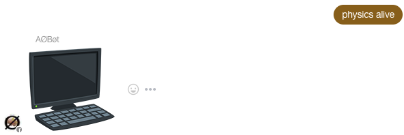


However, being a bot comes with its own set of advantages. For example, the bot can remove a user for a certain period of time before adding them back automatically!


Because the bot interfaces directly with Facebook's endpoints through the Facebook Chat API, it often has access to an expanded set of abilities that are not directly available through Messenger's UI.

For instance, it can set the chat emoji to any emoji supported by Messenger rather than just those provided by the default palette, which only contains a limited subset on mobile.


It can also query Facebook to perform searches for users, pages, and groups. This can be used to verify that the user being added via the "add" command is the one you actually want to add: the add command first performs a search for the given user that is weighted based on its Facebook-determined proximity (the "rank" in a search result) and then adds the first user to result from this query.

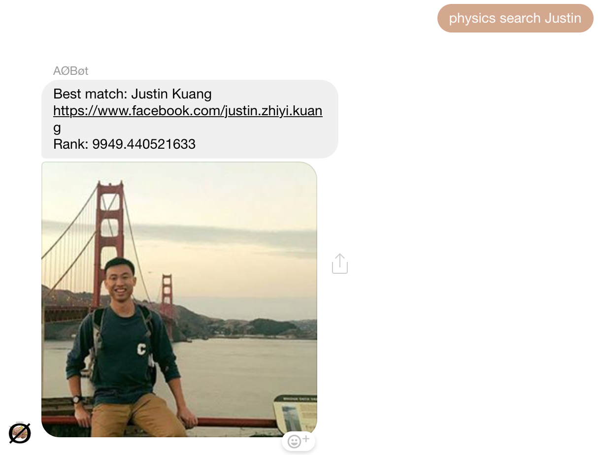

There are plenty more commands like this, such as `poll`, `title`, and `photo`, but they all operate on a similar premise to these basic examples. Check out the help entries (`physics help`) for these commands to learn more.

## Database-dependent Commands

The bot stores information about each conversation that it is a part of in its database. This information is initialized the first time it is added to a chat, so you will see this message:

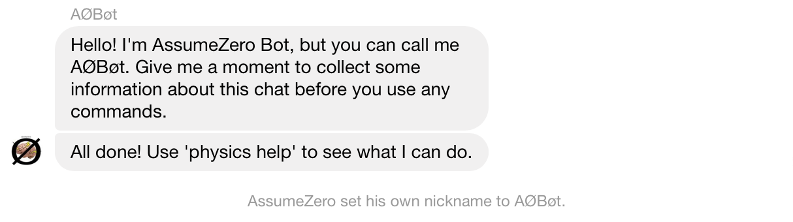

After this, the group's information will be continously updated in the background as it receives new messages. This means that any changes to the group's properties, such as adding/removing users, changing the title or photo, or updating the colors or emoji, will be reflected in the bot's database entry for the conversation, which allows it to stay up-to-date and use these properties when needed without the need for a blocking network call. The properties that are stored reflect only metadata about the chat, and no personal data from chat (such as message history) is stored – the exact list of things stored in the database for any given chat can be viewed in [the definition of the `groupInfo` object](#under-the-hood).

As a result of this persistent storage, certain commands can store and retrieve information about the conversation and its participants.

The simplest of these is the vote command, which comes in two variants, to increase and decrease a user's globally-tracked 'score' respectively:

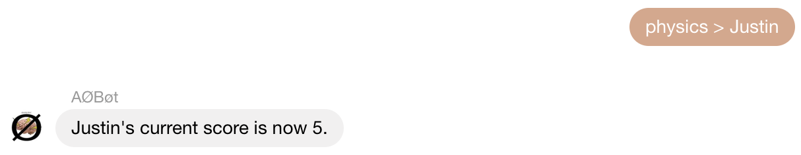


What this score indicates is arbitrary and is up to the user to decide, but regardless of its usage, the scores of any users in a group chat can be shown with the scoreboard command:

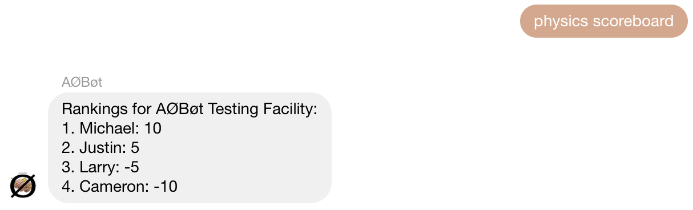

Similarly, the score of a single user can be retrieved with the score command:

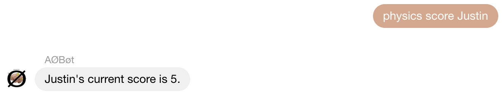

The bot can list statistics for its usage with the stats command – this command can list aggregated data for all commands, but it also takes an optional command argument to display more specific information about a given command, including its most prolific user (if they are in the chat<sup name="link1">[1](#note1)</sup>). The data collected for these statistics does not contain any specific messages from a conversation, but rather global counts of how many times a user has triggered that command. In other words, no private data is stored.

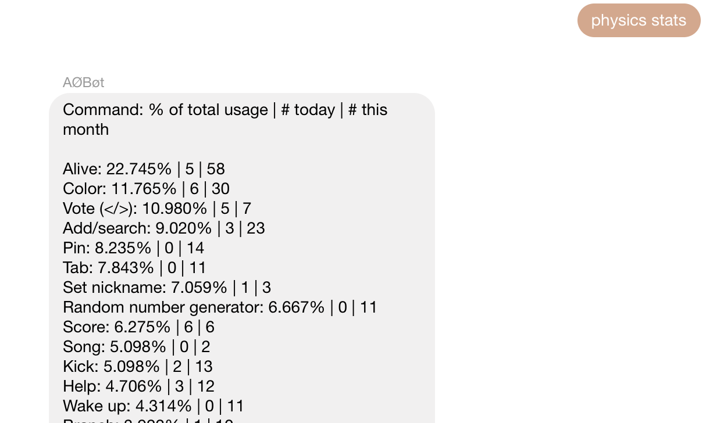

Now for some more interesting stuff – the playlist command interfaces with the Spotify API<sup name="link2">[2](#note2)</sup> to store playlists for each user and retrieve songs from them on command. To add a playlist to the chat, you'll need its [Spotify URI](https://support.spotify.com/us/article/sharing-music) and a user to associate it to. Once stored, the song command can be used to get a random song from it. See the help entries for these commands for more information.

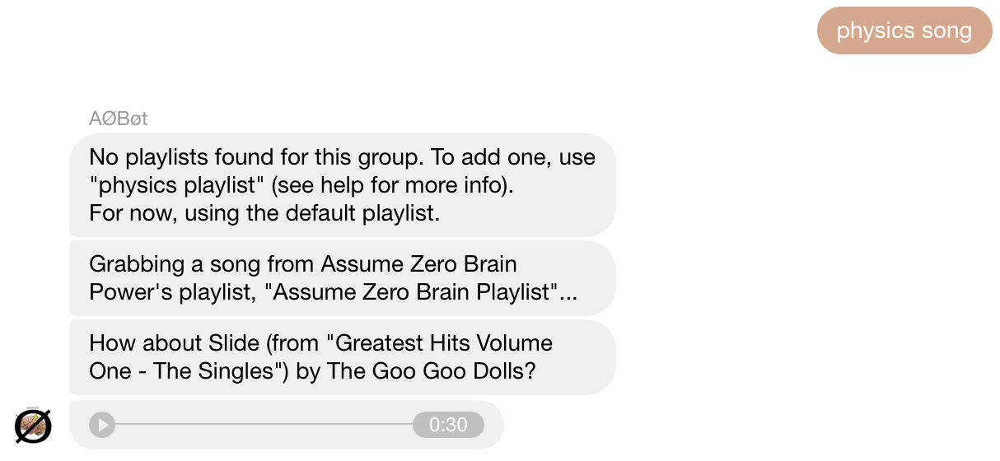

## Chat Management Commands

The following commands are most useful in a group setting, and provide some additional functionality to Messenger group chats.

First, the pin command allows members to pin messages to the chat to be retrieved later; this is useful for keeping track of information in an active chat where it would otherwise get buried.

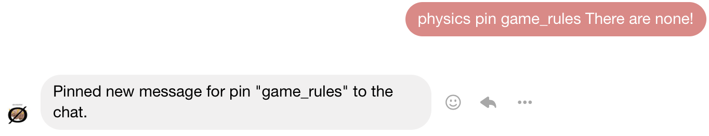
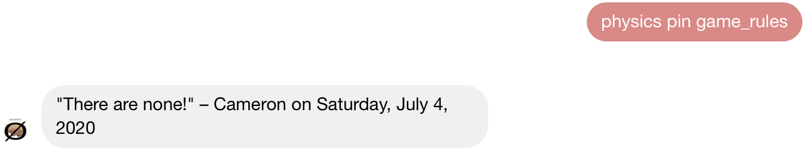

You can pin as many messages as you want, and use "physics pin" to retrieve a list of them:

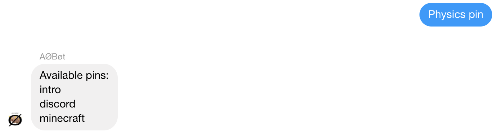

Lastly, there's a special pin called "intro" which, if set, will be shown to new members who are added to the chat:

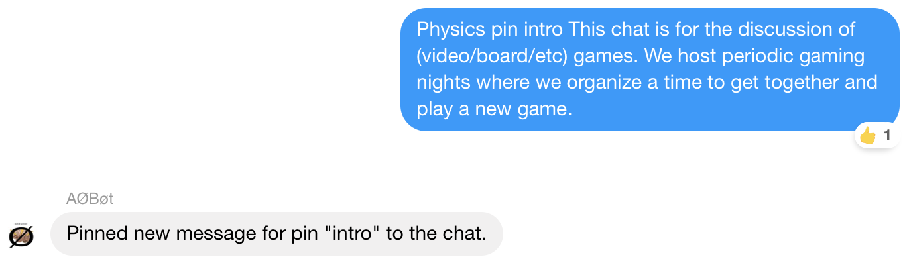
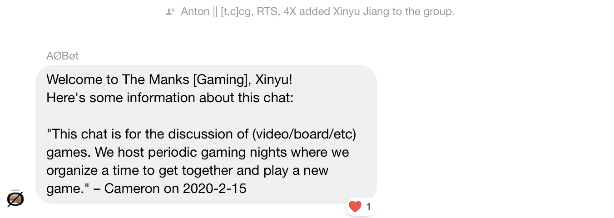

Next up is an event command, which can be used to create and RSVP to events for a chat. Users who respond "going" to the event will be reminded in the chat before the event starts. This command is a replacement for the Messenger "Plans" feature, which was removed in a redesign.

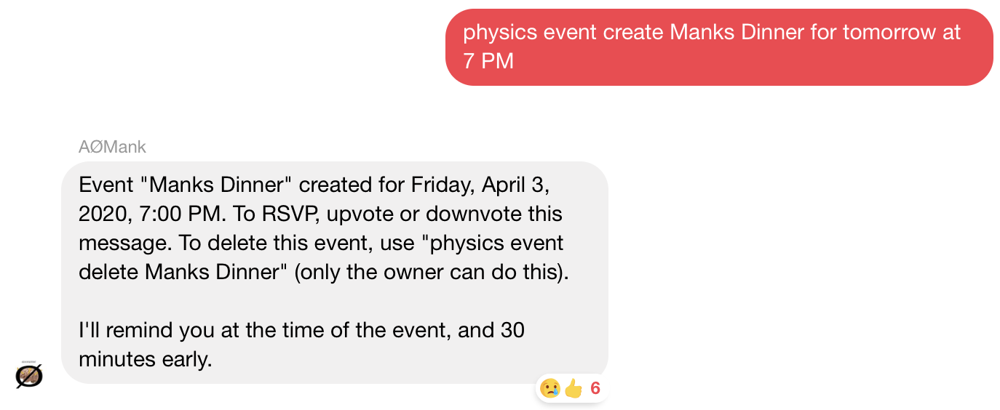
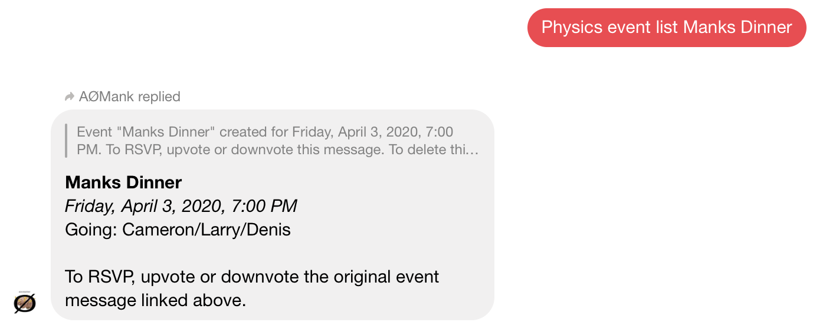
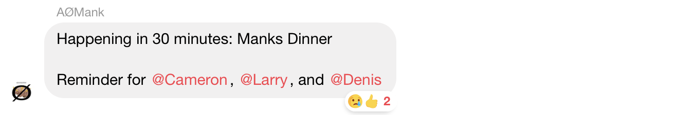

There are several other useful chat management commands, like mention groups for saving groups of users to @mention simultaneously, and tab for keeping a running tab of expenses. See the help category "physics help misc" for more.

# Fun Commands

**Note**: Several of these commands interface with external APIs that may require configuration in [`config.js`](src/config.js), but for the most part can be used with the keys I've already provided (although you may want to generate your own for each API so that we're not sharing usage limits).

These commands are pretty simple, so I'll show them without explanation and you can get more info in the help entries:

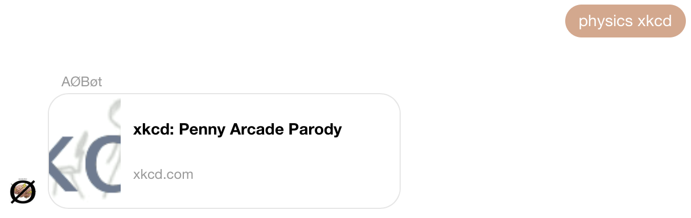
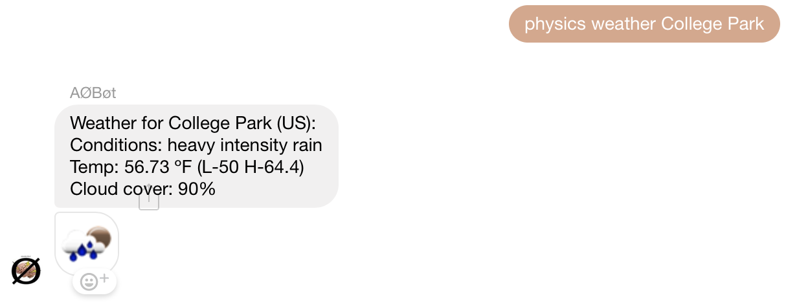
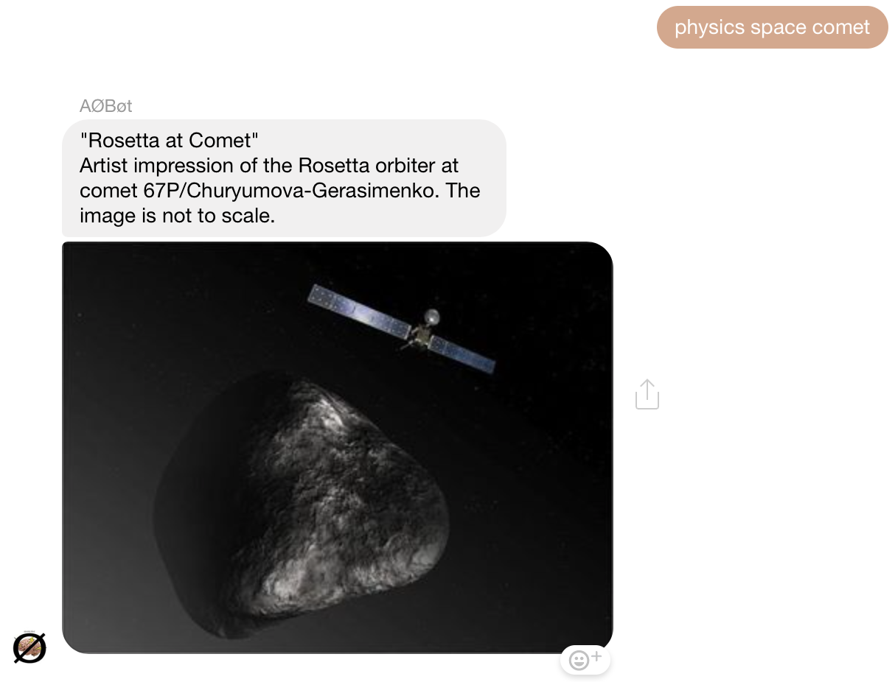
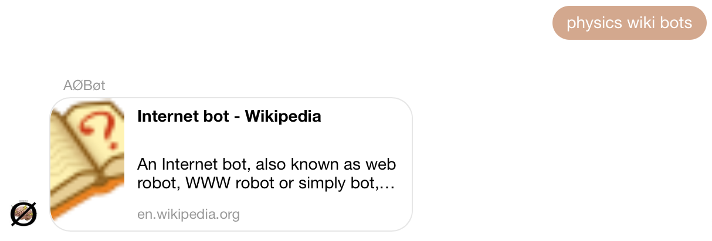
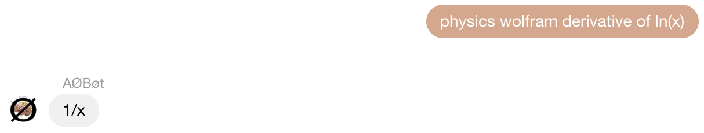

Be careful with this one (see [Under the Hood](#under-the-hood) for safety precautions taken):

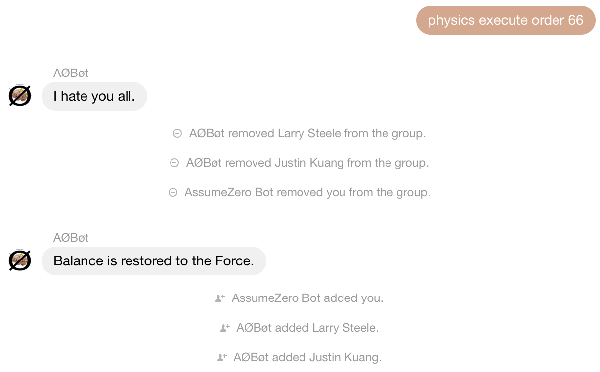

This command was a lot more interesting when Messenger's backend accepted arbitrary hex values for the group color, but it can still enumerate through all of the whitelisted colors in the palette.

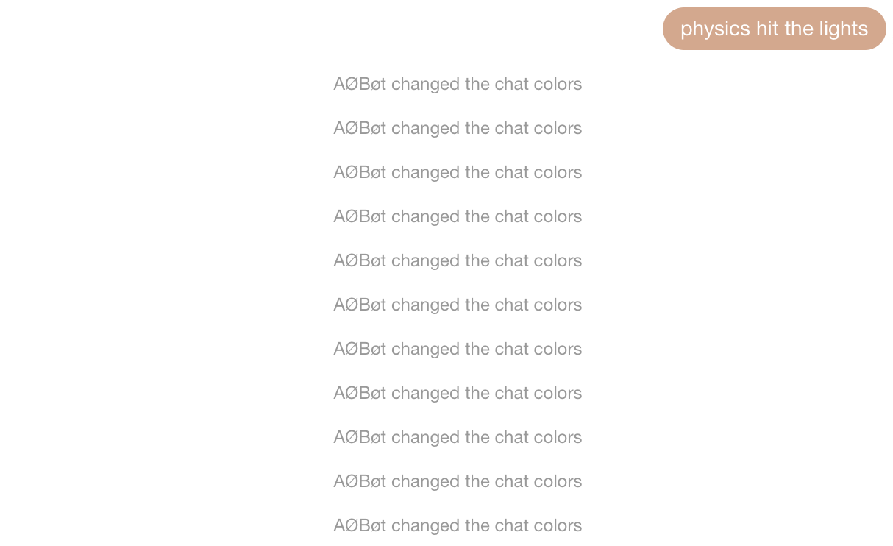

This one can be pretty spammy (and can also get the Facebook account that the bot is using temporarily or permanently banned, speaking from experience). It is configurable in [`config.js`](config.js).


Lastly, the random message command will get a random message from the current conversation, but it is quite finnicky on Facebook's end, so YMMV.

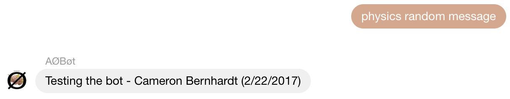

# Setup

To get your own instance of the bot, you'll first need to clone this repo. Once you've done that, you'll need to do several things to set up its associated services – this project was written using Heroku for hosting (although it can be run locally) and memcache (via MemCachier) as a pseudo-database solution. The rest of these setup instructions will assume the use of these services, but the functionalities that they serve are encapsulated in wrapper functions that can be easily modified to use another solution if desired. If you decide to do this, you may wish to utilize [`config.js`](src/config.js) and read [Under the Hood](#under-the-hood).

> ## Note
> Configuration has moved to [BotCore](https://github.com/AstroCB/BotCore), so the Heroku-related instructions are not used anymore beyond the Heroku-related commands. The only required credentials are the `MEMCACHIER_` variables. To obtain these, you'll have to either [add MemCachier as an add-on](https://github.com/AstroCB/AssumeZero-Bot/issues/13#issuecomment-653367466) if you're deploying it through Heroku, or [sign up for a MemCachier cache](https://github.com/AstroCB/AssumeZero-Bot/issues/14#issuecomment-653734900) on their website otherwise.
> 
> You will also need the `FACEBOOK_EMAIL` and `FACEBOOK_PASSWORD` variables unless you already have another BotCore instance running that has successfully logged in. See [the BotCore docs](http://cameronbernhardt.com/BotCore/interfaces/types.logincredentials.html) for more details.

All of the following variables need to be exported from a `credentials.js` file in the `src` directory (ideal if running locally) or exposed as environment variables (on Heroku, this can be done with config vars in the settings tab).

```js
// Facebook log-in credentials for bot account
exports.FACEBOOK_EMAIL = "";
exports.FACEBOOK_PASSWORD = "";
// Heroku application token
exports.TOKEN = "";
// MemCachier credentials (from MemCachier dashboard)
exports.MEMCACHIER_PASSWORD = "";
exports.MEMCACHIER_SERVERS = "";
exports.MEMCACHIER_USERNAME = "";
// Spotify API credentials
exports.SPOTIFY_CLIENTID = "";
exports.SPOTIFY_CLIENTSECRET = "";
// Wolfram short-answer API key
exports.WOLFRAM_KEY = "";
// Open Weather Map API key
exports.WEATHER_KEY = "";
```

Some things to note: MemCachier can be configured from Heroku add-ons, and the email and password should be for the account you want to run the bot on, which isn't necessarily your own account. If you have trouble logging in, try logging in through a browser as Facebook may occasionally lock you out for suspicious behavior – this can usually be fixed by logging in manually and completing a CAPTCHA.

You don't _need_ to set up all of these services, but if you don't, their associated commands will not be functional. At minimum however, you need to expose the email, password, and MemCachier variables for the bot to run.

# Under the Hood
At the highest level, the bot listens to a stream of messages, calling the `handleMessage` function when one is received. This function has two main tasks: (1) parse the message to determine which (more specific) handler function it should be passed to and (2) update the information associated with the group in memory. These tasks are performed in parallel, and if no information is currently stored about the thread, it is initialized in the database. The database also stores the appstate after logging in so that a hard user/password login doesn't have to be performed every time. To purge this appstate, use `make logout` or check out login management in BotCore.

There are three main types of messages to handle: passive messages, Easter eggs, and commands. They all have associated handling functions (`handlePassive`, `handleEasterEggs`, and `handleCommand`) and are available externally by requiring their containing module. Passive messages are special types of messages that will trigger the bot without directly invoking it with a trigger word – these are typically links that can be expanded to provide inline content. Easter eggs are a set of hidden responses from the bot that can be configured in [`easter.js`](src/easter.js). These are off by default, and must be manually enabled on a per-chat basis. Lastly, commands are the main feature of the bot and comprise the majority of its codebase.

The bot's command structure can be changed to be "context-free"; in this mode, it doesn't care where in the message the trigger word is used and what comes before it – as a result, only the text following the trigger word is passed to the `handleCommand`. The user ID of the sender, the `groupInfo` object for the thread, and the full message object from the listener are also passed. By default, commands adhere to a more strict invocation; to configure this behavior, see `contextless` in [`config.js`](src/config.js).

The `groupInfo` object is a record of the information stored in the database for a given thread, and it is passed to most utility functions used in [`runcommand.js`](src/runcommand.js) by `handleCommand`. Its structure changes with the internals of Facebook's message representation and facebook-chat-api's parsing of it, but it is currently represented as follows:

```js
let groupInfo = {
    // Thread's ID (used by facebook-chat-api)
    "threadId": string,
    // Last message received in the thread
    "lastMessage": facebook_chat_api.messageObj,
    // Name of the chat (if it exists), or the names of its members separated by '/'
    "name": string,
    // The current thread emoji
    "emoji": string,
    // The URL of the current group photo
    "image": string,
    // The current thread color (as a hex string)
    "color": string,
    // A map from user IDs to nicknames
    "nicknames": {string: string},
    // An array of user IDs representing the admins of the group
    "admins": [string],
    // Whether the chat has Easter eggs muted (true by default)
    "muted": bool,
    // A map from user IDs to stored Spotify playlist objects, which have these props:
    // name, id, user, uri
    "playlists": {string: playlistObj},
    // A map from user IDs to name aliases (which can be used in commands)
    "aliases": {string: string},
    // A map from pin names to stored pins for the chat including sender and time info
    "pinned": {string: pinObj},
    // A map from event names to stored events for the chat including time and RSVP info
    "events": {string: eventObj},
    // A map from mention group names to lists of user IDs representing their members
    "mentionGroups": {string: [string]},
    // A flag that records whether the thread is a group
    "isGroup": bool,
    // A map from first names of thread members to user IDs
    "members": {string: string},
    // A map from user IDs to first names of thread members
    "names": {string: string},
    // A regular expression that matches first names and aliases of members in the thread
    "userRegExp": string
}
```